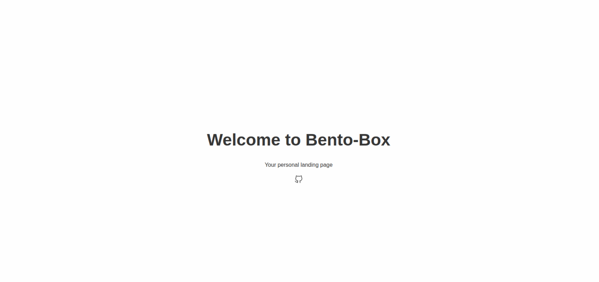

# Bento-Box

<center>
    
</center>

## Intro

Bento-Box is a small web application that serves as a personal landing page. Goal is to provide a customizable and minimalistic starting point when opening a new browser tab.

Dark mode is supported and switches automatically, based on system preference. Additionally, the layout is fully responsive, so it works well on both desktop and mobile devices.

## Setup

The configuration is done via the `config.json` file. You can find an example configuration in `./html/config.json`, or alternative in `./helm/values.yaml`. Icons are provided via [Iconoir](https://iconoir.com/). To choose one, select the name of the desired icon and put it together with the prefix `iconoir-`. For example, to use the "github" icon, you would specify `iconoir-github` in the configuration.

## Build

### Docker

```shell
VERSION=2.0.0
docker build -t ghcr.io/felixzmn/docker/bentobox:$VERSION -t ghcr.io/felixzmn/docker/bentobox:latest .
docker push ghcr.io/felixzmn/docker/bentobox:$VERSION
docker push ghcr.io/felixzmn/docker/bentobox:latest

```

### Helm

```shell
cd helm
helm package .
helm push bentobox-*.tgz oci://ghcr.io/felixzmn/helm
```

## Debugging

```shell
python3 -m http.server
```

Then open `http://localhost:8000/html/` in your browser.
